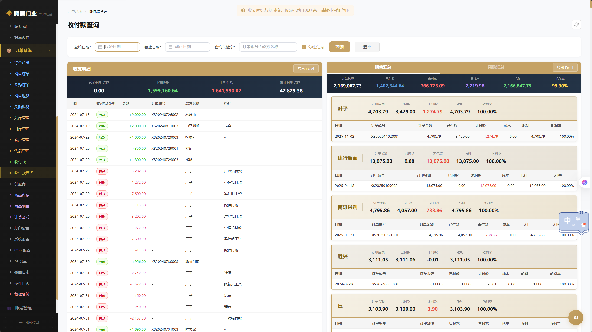
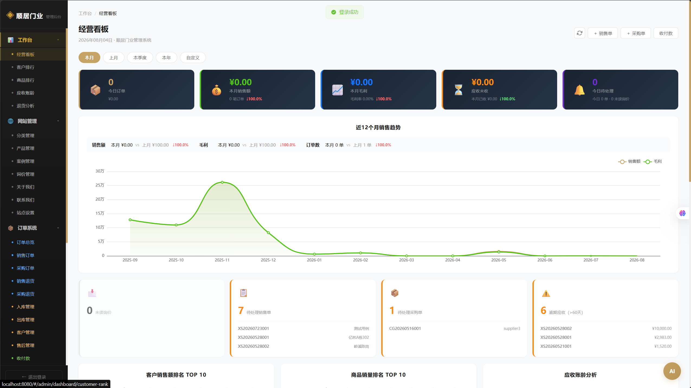
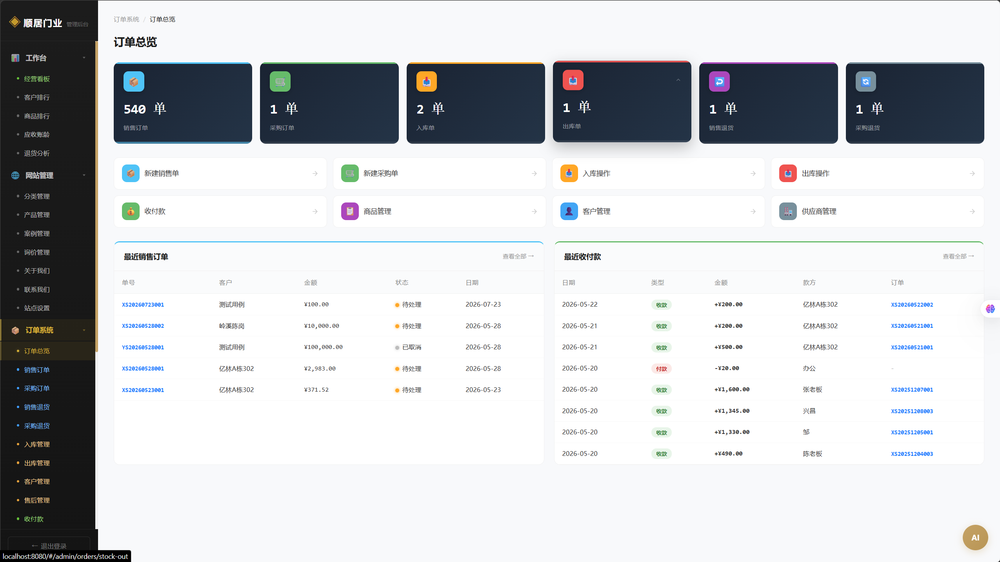
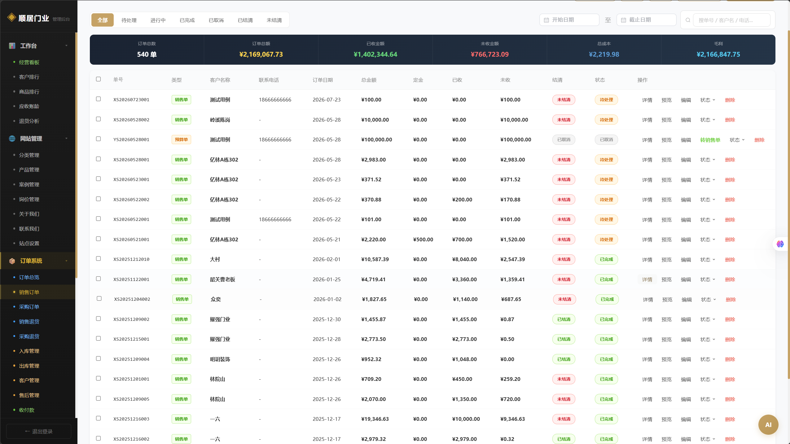
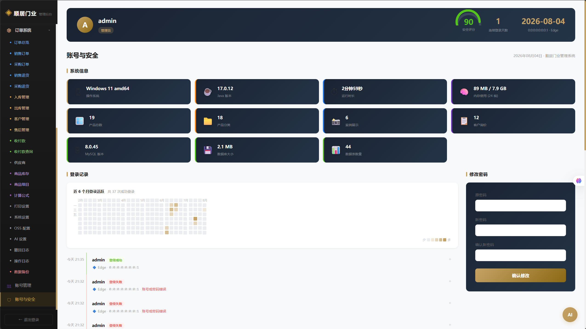

<div align="center">

# 🚪 顺居门业管理系统

**Window System · 门窗门店一体化管理平台**

> 销售订单 · 采购库存 · 财务应收 · 产品计价 · 公式引擎 · 打印报表 · 桌面客户端

<br/>


**覆盖门窗定制企业核心业务全流程 · 前后端一体化 · Windows MSI 安装包**

</div>

---

## 📌 快速导航

| 导航 | 说明 |
|------|------|
| [✨ 功能亮点](#-功能亮点) | 一张表看懂系统能力 |
| [🏗️ 系统架构](#-系统架构) | 技术选型与分层 |
| [📦 核心功能模块](#-核心功能模块) | 销售 / 采购 / 库存 / 财务 / 计价 / 打印 |
| [🧠 关键技术点](#-关键技术点与难点解决) | 公式引擎 / 并发锁 / 数据安全 |
| [🗄️ 数据模型](#-数据模型设计) | 核心业务表结构 |
| [🚀 快速运行](#-快速运行指南) | 开发与打包 MSI |
| [🖼️ 界面预览](#-界面预览) | 界面截图（待补充） |

---

## ✨ 功能亮点

| | | |
|---|---|---|
| 🧾 **销售订单管理** | 📦 **采购与库存** | 💰 **财务与应收** |
| 下单 → 收款 → 发货 → 售后退换 | 采购入库 / 出库 / 库存核算 | 收款流水 / 应收账龄 / 付款报表 |
| 📐 **产品与计价引擎** | 🖨️ **打印与导出** | 🔐 **数据备份恢复** |
| 多类门窗产品 + 可配置公式 | 打印预览 / Excel 导入导出 | SQL 一键备份与还原 |
| 🖥️ **桌面客户端** | 🛡️ **安全体系** | ⚡ **稳定性优化** |
| Tauri 2 打包 MSI | JWT + AES + 操作审计 | 崩溃日志 / JVM 自适应 |

---

## 🏗️ 系统架构

### 技术选型总览

| 层面 | 技术 | 说明 |
|------|------|------|
| 桌面外壳 | **Tauri 2** | 轻量壳，WebView2 渲染，打包 MSI，内存占用低 |
| 后端 | **Spring Boot 3.3.7** (Java 17) | 分层架构，事务管理 |
| 持久层 | **MyBatis-Plus 3.5.5** | 通用 CRUD + 逻辑删除 + 分页 |
| 数据库 | **H2**（默认单机）/ MySQL 8.0 | 离线可用，生产可切换 |
| 认证 | **JWT** (jjwt) | 无状态令牌 + 单会话 |
| 加密 | **BCrypt + AES-256-GCM** | 密码哈希 + 敏感字段加密 |
| 前端 | **Vue 3.4 + Element Plus + ECharts** | 组件化 + 数据可视化 |
| 打印 | html-to-image / jsPDF / ExcelJS | 打印预览 / 图片 / Excel |

### 部署形态

- **桌面应用**：Tauri 壳内嵌 Spring Boot JAR，启动访问 `localhost:8080`，H2 文件库离线可用
- **前后端一体化**：Vue 产物打包进 `src/main/resources/static/`，单 JAR 同源部署

### 分层架构

```
Controller（接口层） → Service（业务层） → Mapper（MyBatis-Plus） → Entity → H2/MySQL
                          ↕
   JWT 拦截器 / AOP 操作日志 / 全局异常 / 安全响应头
```

- 27 个 REST 控制器 · 190+ 接口 · 统一返回 `Result(code/msg/data)`
- 60 个 Service · 34 个实体 · 逻辑删除全局配置
- JWT 拦截 / 通用接口限流 / AOP 审计 / 全局异常 / 安全头

---

## 📦 核心功能模块

### 1️⃣ 销售订单与售后

- 订单全流程：下单 → 收款 → 发货 → 完成，状态机驱动
- 订单明细 + 收款记录关联 + **金额自由编辑（砍价）**
- 销售退货、售后订单独立模块
- **单据锁 `OrderLock`**：并发编辑保护，防止互相覆盖

### 2️⃣ 采购与库存

- 采购订单 / 退货 / 入库单，供应商对账
- 入库、出库、商品级库存核算
- 商品与分类管理

### 3️⃣ 客户、供应商与跟进

- 客户 / 供应商档案
- 客户跟进记录：时间 / 方式 / 内容 / 下次提醒

### 4️⃣ 财务与报表

- 收款 / 支出统一流水
- **应收账龄分析**：逾期预警
- 付款报表 / 营收分析 / 客户排名 / 产品排名
- 运营仪表盘实时看板

### 5️⃣ 产品、计价公式与打印

- 门窗产品：断桥铝 / 推拉门 / 平开门等多品类
- **计价公式引擎**：`宽*高/1000000`、`(宽+高)/1000`、`高*2/1000` 等，支持加减乘除 / 括号 / 取模 / 多变量，**中文符号自动转英文**
- **打印预览**：标题 / 表体 / 汇总分区自定义字号与线条
- **包边联动**：推拉门 → 单包 / 双包，尺寸 / 米数 / 樘数联动

### 6️⃣ 系统安全与运维

- JWT 认证 + 同账号单会话 + 通用接口限流
- AOP 操作审计 + 登录日志
- **SQL 备份恢复**：一键备份 / 还原 / 恢复前自动安全备份
- **崩溃日志**：异常退出自动保存到桌面
- **低配优化**：JVM 堆按内存自适应（256 / 384 / 512MB）

---

## 🧠 关键技术点与难点解决

| 问题 | 解决思路 |
|------|----------|
| 多员工并发编辑单据 | **OrderLock 单据锁**：编辑前锁定、保存时校验归属 |
| 自定义公式计算错误 | **双解析器对齐**：前端 `safeEval`（JS）+ 后端 `SafeMathEvaluator`（Java）逐字符一致，**面积列 = 实际公式结果** |
| 中文括号 / 乘除号导致解析失败 | 输入框 **@input 实时转英文** + 前后端三层 normalize |
| 高端多数量金额溢出 | 字段 `DECIMAL(12,2)` 精度扩容 |
| 低配机启动卡死 | JVM 堆按机器内存自适应 + 防重启风暴 |
| 崩溃无法排查 | 会话标记检测异常退出，下次启动自动保存崩溃日志 |

### 安全设计（可放心开源）

- ✅ BCrypt 哈希存密码，不存明文
- ✅ 数据库 / JWT / AES 密钥全部**环境变量注入，代码零明文**
- ✅ 含密钥配置文件、SQL 数据、构建产物均已在 `.gitignore` 排除
- ✅ 通用限流 + 安全响应头 + 操作审计

---

## 🗄️ 数据模型设计

| 域 | 核心表 | 职责 |
|----|--------|------|
| 用户权限 | `admin` | 管理员（super_admin / admin） |
| 销售域 | `sale_order` / `item` / `return` / `after_sale_order` | 订单 / 明细 / 退货 / 售后 |
| 采购域 | `purchase_order` / `item` / `return` / `supplier` | 采购 / 明细 / 退货 / 供应商 |
| 库存域 | `commodity` / `category` / `stock_in` / `stock_out` | 商品 / 分类 / 出入库 |
| 产品域 | `product` / `product_type` / `pricing_formula` / `case_info` | 产品 / 型号 / 公式 / 案例 |
| 客户域 | `customer` / `followup` / `enquiry` | 客户 / 跟进 / 询价 |
| 财务域 | `payment` | 收付款流水 |
| 系统域 | `login_log` / `operation_log` / `sys_config` / `print_setting` / `order_lock` / `order_sequence` | 日志 / 配置 / 打印 / 锁 / 序列 |

```
Customer 1──N SaleOrder 1──N SaleOrderItem
SaleOrder 1──N Payment       /  1──1 OrderLock
Commodity 1──N StockIn/StockOut
```

---

## 📁 工程结构

```
window-system
├── src/main/java/com/window/
│   ├── controller/      27 个 REST 控制器
│   ├── service/         60 个 Service
│   ├── mapper/          MyBatis-Plus Mapper
│   ├── entity/          34 个实体
│   ├── common/          JWT / 公式求值器 / 工具
│   ├── config/          拦截器 / 全局异常 / AOP / Web
│   └── WindowApplication.java
├── frontend/            Vue 3 SPA（36 视图 + 打印组件）
├── src-tauri/           Tauri 2 桌面壳（MSI 打包）
├── src/main/resources/db/   数据库迁移 migration-*.sql
├── docs/adr/           MADR 架构决策
└── README.md
```

---

## 🚀 快速运行指南

### 环境要求

JDK 17+ · Maven 3.6+ · Node 18+ · Rust（Tauri 打包）

### 1. 后端开发模式

```bash
cp src/main/resources/application-local.example.yml src/main/resources/application-local.yml
# 编辑该文件，替换示例密钥为你的密钥
mvn spring-boot:run      # http://localhost:8080
```

### 2. 前端开发模式（可选）

```bash
cd frontend
npm install
npm run dev              # http://localhost:3000（Vite 代理 /api → 8080）
```

### 3. 构建 Windows MSI

```bash
build-msi.bat
# 手动：
cd frontend && npm run build
mvn package -DskipTests
cp target/*.jar src-tauri/resources/
cd src-tauri && cargo tauri build    # 产物 target/release/bundle/msi/
```

---

## 🔧 环境变量配置

| 变量 | 必填 | 默认值 | 说明 |
|------|:---:|--------|------|
| `SPRING_PROFILES_ACTIVE` | ❌ | `local` | 激活配置（local/dev/prod） |
| `JWT_SECRET` | ✅ | — | JWT 签名密钥（≥32 字节） |
| `AES_KEY` | ✅ | — | AES-256-GCM 密钥（Base64 32 字节） |
| `DB_HOST/PORT/NAME` | ❌ | localhost/3306/window_db | 生产数据库 |
| `DB_USERNAME/PASSWORD` | ✅(prod) | — | 生产库账号密码 |

> 🔒 所有密钥环境变量注入，代码零明文；本地参考 `application-local.example.yml`。

---

## ❓ 常见问题 FAQ

**Q1：启动报 "app.encryption.secret 未配置"？**
未设置 AES 密钥。参考 `application-local.example.yml` 配置后重启。

**Q2：登录报 JWT 错误？**
`jwt.secret` 未配置或 <32 字节。设置 ≥32 字节签名密钥。

**Q3：桌面应用数据在哪？**
Program Files 安装 → 数据在 `%APPDATA%\com.shunjumc.window-system`；D 盘安装 → 安装目录 `data/`。

**Q4：异常退出想排查？**
重启后桌面上会出现「崩溃日志」文件，发送给开发者即可。

**Q5：自定义公式算不对？**
确认用英文括号/运算符（中文符号会自动转英文）；变量名与参数一致（宽/高/墙厚/樘数）。

**Q6：如何备份数据？**
「数据备份」页创建备份 → 下载 .sql 保存；恢复前系统自动安全备份。

---

## 🖼️ 界面预览

> 系统主要界面展示

### 照片 1



> 系统登录界面

### 照片 2



> 经营看板 / 数据仪表盘

### 照片 3



> 销售订单管理

### 照片 4



> 商品明细与计价

### 照片 5



> 打印预览

---

## 🏆 项目亮点总结

| 维度 | 亮点 |
|------|------|
| 🏗️ 业务完整度 | 询价 → 报价 → 订单 → 收款 → 发货 → 售后 → 对账全闭环 |
| 📦 进销存一体化 | 采购 / 库存 / 商品核算 |
| 📐 计价公式引擎 | 自定义公式 + 包边联动 + 前后端一致 + 中文符号转换 |
| 🖨️ 打印与导出 | 分区自定义打印 / Excel 导入导出 |
| 🖥️ 桌面交付 | Tauri 打包 MSI，单机离线可用 |
| 🛡️ 安全性 | JWT + 单会话 + BCrypt + AES + 审计 + 密钥环境变量化 |
| 🔐 运维能力 | SQL 备份恢复 + 崩溃日志 + 低配优化 + 并发锁 |
| 📐 工程规范 | 四层架构 / 统一返回 / 全局异常 / AOP / 迁移脚本 / ADR |

---

## 🙏 致谢

- **前端**：[Vue 3](https://vuejs.org/) · [Element Plus](https://element-plus.org/) · [ECharts](https://echarts.apache.org/)
- **后端**：[Spring Boot](https://spring.io/projects/spring-boot) · [MyBatis-Plus](https://baomidou.com/)
- **桌面**：[Tauri](https://tauri.app/) · [WebView2](https://developer.microsoft.com/microsoft-edge/webview2/)
- **数据库**：H2 · MySQL

> 📌 本仓库遵循 MIT 协议，不含真实业务数据、客户隐私与密钥配置（已 `.gitignore` 排除）。

---

<div align="center">

**⭐ 如果对你有帮助，欢迎 Star & Fork**

[主页 →](https://github.com/YZzy2006/WindowSystemApp)

</div>